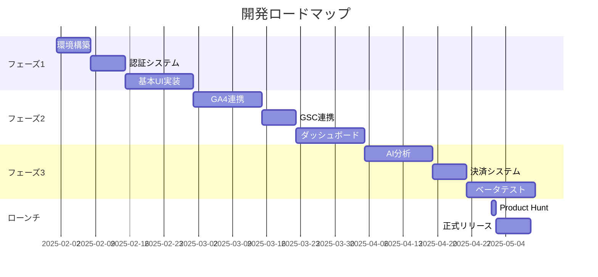

# Coffee Analytics 要件定義書 v2.0

## 1. プロダクト概要

### 1.1 製品名
**Coffee Analytics** - 1分で始められる、シンプルで柔軟なWeb分析ツール

### 1.2 ビジョン
「必要な機能を、必要な時に」- ユーザーが自分のペースで機能を選択・拡張できる、日本発のプライバシー重視型Web分析プラットフォーム

### 1.3 コアコンセプト
```yaml
3つの選択的機能:
1. 独自トラッキング（基本分析）- 1分で導入
2. GSC連携（SEO分析）- 任意で追加
3. GA4インポート（データ移行）- 必要に応じて

ユーザーは必要なものだけを選んで使える
```

### 1.4 ターゲット市場
- **プライマリ**: 日本の個人開発者、ブロガー、小規模ECサイト運営者
- **セカンダリ**: SEO担当者、Webマーケター、フリーランス
- **ターシャリ**: 小規模Web制作会社、マーケティング代理店

### 1.5 価格戦略
```yaml
エッセンシャル: 980円/月
- 1サイト
- 全機能アクセス（独自トラッキング、GSC連携可）
- 週次AI分析
- メールサポート

プロフェッショナル: 1,980円/月【推奨】
- 5サイト
- 全機能アクセス
- 日次AI分析
- 優先サポート
- API アクセス

ビジネス: 3,980円/月
- 無制限サイト
- 全機能アクセス
- リアルタイムAI分析
- 専用サポート
- ホワイトラベル対応

年間割引: 20%OFF（2ヶ月分お得）
創業者割引: 最初の100名は永続30%OFF
```

---

## 2. コア機能要件

### 2.1 オンボーディングフロー

#### 2.1.1 初回セットアップウィザード
```yaml
Step 1: アカウント作成
- Googleアカウントでワンクリックログイン
- Better-Auth使用（OAuth 2.0）
- メールアドレス入力不要

Step 2: サイト登録
- ドメイン入力
- サイト名設定

Step 3: 機能選択画面
┌─────────────────────────────────────────┐
│  Coffee Analyticsへようこそ！          │
│  どの機能から始めますか？              │
│                                        │
│  ☑ 基本分析を始める（必須）            │
│     訪問者数、ページビュー、流入元など │
│     → 1行のスクリプト追加だけ          │
│                                        │
│  ☐ SEO分析を追加する（推奨）          │
│     検索キーワード、順位、CTRなど      │
│     → Google Search Console連携        │
│                                        │
│  ☐ 既存データを移行する（任意）        │
│     GA4の過去データをインポート        │
│     → Google Analytics連携             │
│                                        │
│  [今すぐ始める] [後で設定する]         │
└─────────────────────────────────────────┘

Step 4: トラッキングコード表示
- コピー&ペースト用のコード表示
- 主要CMS別の設置ガイド提供
- 設置確認機能（自動検証）
```

#### 2.1.2 段階的な機能有効化
- ダッシュボードから随時GSC連携可能
- 使い始めてから必要に応じて機能追加
- 各機能に「設定する」ボタン配置

### 2.2 データ収集機能

#### 2.2.1 独自トラッキング（コア機能）
```javascript
// 超軽量スクリプト（< 1KB）
<script defer data-site="SITE_ID" 
        src="https://cdn.coffeeanalytics.com/ca.js">
</script>
```

**収集データ:**
- ページビュー、ユニークビジター
- リファラー（流入元）
- 滞在時間、直帰率
- デバイス種別、画面サイズ
- ページ遷移フロー
- カスタムイベント（クリック、フォーム送信等）

**技術仕様:**
- Cookie不使用（プライバシー保護）
- リアルタイムデータ収集
- SPA対応（自動検知）
- 軽量（gzip圧縮で900バイト以下）

#### 2.2.2 GSC連携（オプション）
```yaml
連携方法:
1. ダッシュボードから「GSC連携」ボタン
2. Googleアカウント認証（OAuth 2.0）
3. プロパティ選択
4. 自動データ同期開始

取得データ:
- 検索クエリ（キーワード）
- 検索順位
- クリック率（CTR）
- インプレッション数
- ページ別検索パフォーマンス

更新頻度:
- 1日1回自動更新（GSC API制限対応）
- 手動更新も可能
```

#### 2.2.3 GA4インポート（オプション）
```yaml
目的:
- 過去データの継続性確保
- 既存ユーザーの移行支援

インポート内容:
- 過去2年分のトラフィックデータ
- ページ別統計
- 流入元データ

実行タイミング:
- 初回セットアップ時
- または後から設定画面で実行
```

### 2.3 ダッシュボード機能

#### 2.3.1 アダプティブダッシュボード
```yaml
特徴:
- 有効化された機能のみ表示
- 未連携機能は「有効化を促すカード」として表示
- ユーザーの成長に合わせて拡張
```

#### 2.3.2 基本分析ビュー（独自トラッキング）
```
┌─────────────────────────────────────┐
│  📊 今日のパフォーマンス            │
│  訪問者: 1,234 (+15%)               │
│  ページビュー: 3,456 (+8%)          │
│  平均滞在時間: 2:34                 │
│  直帰率: 45.2%                      │
└─────────────────────────────────────┘

┌─────────────────────────────────────┐
│  🌐 トップ流入元                     │
│  1. Direct (45%)                    │
│  2. Google (30%)                    │
│  3. Twitter (15%)                   │
│  4. その他 (10%)                     │
└─────────────────────────────────────┘

┌─────────────────────────────────────┐
│  📱 デバイス別                       │
│  Desktop: 60%                       │
│  Mobile: 35%                        │
│  Tablet: 5%                         │
└─────────────────────────────────────┘

┌─────────────────────────────────────┐
│  📄 人気ページ                       │
│  1. /blog/seo-tips (523 views)      │
│  2. /products (412 views)           │
│  3. /about (234 views)              │
└─────────────────────────────────────┘
```

#### 2.3.3 SEO分析ビュー（GSC連携時のみ）
```
┌─────────────────────────────────────┐
│  🔍 SEO分析（Google Search Console） │
│  ● 連携済み                          │
│                                      │
│  検索流入: 892 クリック             │
│  平均CTR: 3.2%                      │
│  平均掲載順位: 18.5                 │
└─────────────────────────────────────┘

┌─────────────────────────────────────┐
│  🎯 トップ検索キーワード             │
│  1. GA4 使い方 (位置: 3, CTR: 28%)  │
│  2. SEO ツール (位置: 8, CTR: 12%)  │
│  3. Web分析 簡単 (位置: 5, CTR: 18%)│
└─────────────────────────────────────┘
```

#### 2.3.4 未連携機能の表示
```
┌─────────────────────────────────────┐
│  🔍 SEO分析を始めましょう            │
│                                      │
│  Google Search Consoleを連携すると  │
│  検索キーワードや順位が分かります    │
│                                      │
│        [GSCを連携する]              │
│        [後で設定する]               │
└─────────────────────────────────────┘
```

### 2.4 AI分析機能

#### 2.4.1 アダプティブAI分析
```yaml
特徴:
- 有効化されている機能に応じて分析内容が変化
- データ量に応じて分析精度が向上
- ユーザーの利用パターンを学習

独自トラッキングのみ:
- トラフィック傾向分析
- ページパフォーマンス改善提案
- ユーザー行動パターン分析

GSC連携時:
- SEO改善提案
- キーワード最適化アドバイス
- 検索順位向上戦略

両方連携時:
- 統合的な改善提案
- 検索流入とユーザー行動の相関分析
- コンバージョン最適化提案
```

#### 2.4.2 プラン別AI機能
```yaml
エッセンシャル（980円）:
- 週次サマリー生成
- 基本的な改善提案3つ
- 異常検知アラート

プロフェッショナル（1,980円）:
- 日次分析レポート
- 詳細な改善提案5つ
- 予測分析（トレンド予測）
- カスタムアラート設定

ビジネス（3,980円）:
- リアルタイム分析
- 無制限の改善提案
- 競合比較分析
- AIチャットサポート
```

#### 2.4.3 AI提案の例
```json
{
  "date": "2025-02-14",
  "insights": [
    {
      "type": "traffic",
      "priority": "高",
      "title": "モバイル流入が急増",
      "description": "先週比でモバイル流入が40%増加",
      "action": "モバイルページの表示速度を改善しましょう",
      "expected_impact": "直帰率5-10%改善"
    },
    {
      "type": "seo",
      "priority": "中",
      "title": "CTR改善の機会",
      "description": "「GA4 使い方」で3位表示もCTR2.3%",
      "action": "タイトルに「2025年版」を追加",
      "expected_impact": "CTR 5-7%に向上見込み",
      "requires": "gsc"  // GSC連携時のみ表示
    }
  ]
}
```

### 2.4 レポート機能

#### 2.4.1 自動レポート
- 週次サマリーメール（月曜朝9時）
- 月次詳細レポート（月初）
- カスタムアラート設定

#### 2.4.2 エクスポート機能
- PDF形式でのレポート出力
- CSV/Excelデータエクスポート
- Slack/Discord通知連携

---

## 3. 技術要件

### 3.1 技術スタック

#### 3.1.1 フロントエンド
```yaml
フレームワーク: Next.js 16+ (App Router)
言語: TypeScript 5.7+
スタイリング: Tailwind CSS + shadcn/ui
状態管理: Zustand
グラフ: Recharts or Tremor
認証: Better-Auth (Google OAuth専用)

Next.js 16の新機能活用:
- Cache Components（ダッシュボードの高速化）
- Server Components（データフェッチ最適化）
- Partial Prerendering
- Server Actions（フォーム処理）
```

#### 3.1.2 バックエンド
```yaml
フレームワーク: Next.js API Routes (App Router)
データベース: Turso (LibSQL)
ORM: Drizzle ORM
キャッシュ: 
  - Next.js Cache API
  - Turso埋め込みレプリカ（エッジキャッシュ）

独自トラッキング:
  - Edge Runtime対応スクリプト
  - Vercel Edge Functions
  - WebSocket: Pusher or Ably（リアルタイム）

Google連携:
  - googleapis (Node.js用)
  - Better-Auth OAuth handlers
  - GSC API v3
  - GA4 Data API v1

AI/ML:
  - OpenAI API (GPT-4o-mini)
  - Vercel AI SDK
  - Edge Functions対応

バッチ処理:
  - Vercel Cron Jobs
  - Inngest（複雑なワークフロー用）
```

#### 3.1.3 インフラ
```yaml
ホスティング: Vercel (Edge Network)
データベース: 
  - Turso (グローバル分散SQLite)
  - 埋め込みレプリカで低レイテンシ
  
CDN/配信:
  - Vercel Edge Network
  - トラッキングスクリプト配信
  
決済: Stripe
メール: Resend
監視: 
  - Vercel Analytics
  - Sentry (エラー)
  - Posthog (プロダクト分析)
```

### 3.2 API設計

#### 3.2.1 認証エンドポイント（Better-Auth）
```typescript
// Google OAuth専用
GET    /api/auth/sign-in/google     // Googleログイン開始
GET    /api/auth/callback/google    // OAuth コールバック
POST   /api/auth/sign-out           // ログアウト
GET    /api/auth/session            // セッション確認

// Google API連携（追加認証）
POST   /api/connect/gsc             // GSC連携用
POST   /api/connect/ga4             // GA4連携用  
DELETE /api/connect/gsc             // GSC連携解除
DELETE /api/connect/ga4             // GA4連携解除
```

#### 3.2.2 トラッキングエンドポイント
```typescript
// 独自トラッキング
POST   /track                    // イベント受信
GET    /ca.js                   // トラッキングスクリプト配信

// Beacon API対応
POST   /beacon                   // 高速データ受信
```

#### 3.2.3 データ取得エンドポイント
```typescript
// 基本分析（常に利用可能）
GET /api/stats/overview         // 概要
GET /api/stats/realtime         // リアルタイム
GET /api/stats/pages            // ページ別
GET /api/stats/sources          // 流入元
GET /api/stats/devices          // デバイス

// SEO分析（GSC連携時のみ）
GET /api/seo/keywords           // 検索キーワード
GET /api/seo/pages              // ページ別SEO
GET /api/seo/positions          // 順位推移
GET /api/seo/ctr                // CTR分析

// AI分析
GET /api/insights/summary       // AIサマリー
GET /api/insights/suggestions   // 改善提案
POST /api/insights/analyze      // カスタム分析

// 管理
GET /api/sites                  // サイト一覧
GET /api/sites/:id/status       // 連携状態確認
POST /api/sites/:id/verify      // トラッキング確認
```

### 3.3 データモデル（Turso/Drizzle）

#### 3.3.1 スキーマ定義（Drizzle ORM）
```typescript
// schema.ts (Drizzle ORM定義)
import { sqliteTable, text, integer, real, blob } from 'drizzle-orm/sqlite-core';
import { sql } from 'drizzle-orm';

// ユーザー管理
export const users = sqliteTable('users', {
  id: text('id').primaryKey().default(sql`(lower(hex(randomblob(16))))`),
  email: text('email').notNull().unique(),
  name: text('name'),
  image: text('image'),
  googleId: text('google_id').notNull().unique(),
  planType: text('plan_type').default('essential'),
  createdAt: integer('created_at', { mode: 'timestamp' }).default(sql`(unixepoch())`),
  updatedAt: integer('updated_at', { mode: 'timestamp' }).default(sql`(unixepoch())`)
});

// サイト管理
export const sites = sqliteTable('sites', {
  id: text('id').primaryKey().default(sql`(lower(hex(randomblob(16))))`),
  userId: text('user_id').notNull().references(() => users.id, { onDelete: 'cascade' }),
  domain: text('domain').notNull(),
  name: text('name'),
  trackingId: text('tracking_id').unique().default(sql`(lower(hex(randomblob(8))))`),
  
  // 機能フラグ
  trackingEnabled: integer('tracking_enabled', { mode: 'boolean' }).default(true),
  gscEnabled: integer('gsc_enabled', { mode: 'boolean' }).default(false),
  ga4ImportCompleted: integer('ga4_import_completed', { mode: 'boolean' }).default(false),
  
  // Google連携情報（JSON形式で保存）
  gscConfig: text('gsc_config', { mode: 'json' }),
  ga4Config: text('ga4_config', { mode: 'json' }),
  
  createdAt: integer('created_at', { mode: 'timestamp' }).default(sql`(unixepoch())`),
  updatedAt: integer('updated_at', { mode: 'timestamp' }).default(sql`(unixepoch())`)
});

// イベントテーブル（パーティション対応）
export const events = sqliteTable('events', {
  id: integer('id').primaryKey({ autoIncrement: true }),
  siteId: text('site_id').notNull().references(() => sites.id, { onDelete: 'cascade' }),
  
  // 基本情報
  eventType: text('event_type').notNull(), // pageview, event
  visitorHash: text('visitor_hash').notNull(),
  sessionHash: text('session_hash').notNull(),
  
  // ページ情報
  url: text('url'),
  path: text('path'),
  title: text('title'),
  referrer: text('referrer'),
  
  // デバイス情報
  deviceType: text('device_type'),
  screenSize: text('screen_size'),
  browser: text('browser'),
  os: text('os'),
  country: text('country'),
  
  // カスタムイベント
  eventName: text('event_name'),
  eventValue: text('event_value', { mode: 'json' }),
  
  // タイムスタンプ（Unix時間）
  timestamp: integer('timestamp', { mode: 'timestamp' }).notNull(),
  date: text('date').generatedAlwaysAs(sql`date(timestamp, 'unixepoch')`),
  
  // パフォーマンス最適化用
  hour: integer('hour').generatedAlwaysAs(sql`cast(strftime('%H', timestamp, 'unixepoch') as integer)`)
});

// GSCデータ（GSC連携時のみ）
export const gscData = sqliteTable('gsc_data', {
  id: integer('id').primaryKey({ autoIncrement: true }),
  siteId: text('site_id').notNull().references(() => sites.id, { onDelete: 'cascade' }),
  
  date: text('date').notNull(),
  query: text('query'),
  page: text('page'),
  country: text('country'),
  device: text('device'),
  
  clicks: integer('clicks'),
  impressions: integer('impressions'),
  ctr: real('ctr'),
  position: real('position'),
  
  createdAt: integer('created_at', { mode: 'timestamp' }).default(sql`(unixepoch())`)
});

// AI分析結果
export const aiInsights = sqliteTable('ai_insights', {
  id: text('id').primaryKey().default(sql`(lower(hex(randomblob(16))))`),
  siteId: text('site_id').notNull().references(() => sites.id, { onDelete: 'cascade' }),
  
  insightType: text('insight_type'), // daily, weekly, suggestion
  dataSources: text('data_sources'), // tracking, gsc, both
  
  content: text('content', { mode: 'json' }).notNull(),
  
  createdAt: integer('created_at', { mode: 'timestamp' }).default(sql`(unixepoch())`),
  expiresAt: integer('expires_at', { mode: 'timestamp' })
});

// セッション管理（Better-Auth用）
export const sessions = sqliteTable('sessions', {
  id: text('id').primaryKey(),
  userId: text('user_id').notNull().references(() => users.id, { onDelete: 'cascade' }),
  expiresAt: integer('expires_at', { mode: 'timestamp' }).notNull()
});
```

#### 3.3.2 インデックス定義
```typescript
// インデックス（Drizzle ORM）
import { index, uniqueIndex } from 'drizzle-orm/sqlite-core';

// eventsテーブルのインデックス
export const eventsIndexes = {
  siteDate: index('idx_events_site_date').on(events.siteId, events.date),
  visitor: index('idx_events_visitor').on(events.siteId, events.visitorHash),
  path: index('idx_events_path').on(events.siteId, events.path)
};

// gscDataテーブルのインデックス
export const gscDataIndexes = {
  siteDate: index('idx_gsc_site_date').on(gscData.siteId, gscData.date),
  unique: uniqueIndex('idx_gsc_unique').on(
    gscData.siteId, 
    gscData.date, 
    gscData.query, 
    gscData.page
  )
};
```

### 3.4 Next.js 16 Cache Components活用

#### 3.4.1 ダッシュボードの最適化
```typescript
// app/dashboard/[siteId]/page.tsx
import { cache } from 'react';
import { CacheComponent } from 'next/cache';

// キャッシュ戦略
const getStats = cache(async (siteId: string) => {
  return await db.select().from(events).where(eq(events.siteId, siteId));
}, {
  revalidate: 60, // 1分ごとに再検証
  tags: [`site-${siteId}`]
});

// Cache Component活用
export default async function Dashboard({ params }) {
  return (
    <>
      {/* リアルタイムデータ（キャッシュなし） */}
      <RealtimeVisitors siteId={params.siteId} />
      
      {/* 統計データ（1分キャッシュ） */}
      <CacheComponent ttl={60}>
        <StatsOverview siteId={params.siteId} />
      </CacheComponent>
      
      {/* トラフィックグラフ（5分キャッシュ） */}
      <CacheComponent ttl={300}>
        <TrafficChart siteId={params.siteId} />
      </CacheComponent>
      
      {/* SEOデータ（1時間キャッシュ） */}
      <CacheComponent ttl={3600} fallback={<SEOSkeleton />}>
        <SEOAnalytics siteId={params.siteId} />
      </CacheComponent>
    </>
  );
}
```

#### 3.4.2 Turso埋め込みレプリカ活用
```typescript
// lib/turso.ts
import { createClient } from '@libsql/client/web';
import { drizzle } from 'drizzle-orm/libsql';

// エッジ環境用クライアント（埋め込みレプリカ）
export const edgeDb = createClient({
  url: process.env.TURSO_DATABASE_URL!,
  authToken: process.env.TURSO_AUTH_TOKEN!,
  // 埋め込みレプリカでレイテンシ最小化
  syncUrl: process.env.TURSO_SYNC_URL,
  syncInterval: 60 // 60秒ごとに同期
});

// Drizzle ORM統合
export const db = drizzle(edgeDb);
```

#### 3.4.3 Better-Auth設定
```typescript
// auth.config.ts
import { betterAuth } from "better-auth";
import { drizzleAdapter } from "better-auth/adapters/drizzle";
import { db } from "./lib/turso";

export const auth = betterAuth({
  database: drizzleAdapter(db, {
    provider: "sqlite"
  }),
  socialProviders: {
    google: {
      clientId: process.env.GOOGLE_CLIENT_ID!,
      clientSecret: process.env.GOOGLE_CLIENT_SECRET!,
      scopes: ["email", "profile"] // 基本スコープのみ
    }
  },
  session: {
    expiresIn: 60 * 60 * 24 * 30, // 30日
    updateAge: 60 * 60 * 24 // 1日ごとに更新
  }
});
```

---

## 4. 非機能要件

### 4.1 パフォーマンス
- ダッシュボード初期表示: 2秒以内
- API応答時間: 平均500ms以内
- データ更新頻度: 6時間ごと（キャッシュ活用）

### 4.2 セキュリティ
- OAuth 2.0トークン暗号化保存
- APIレート制限（1分100リクエスト）
- SQLインジェクション対策
- XSS/CSRF対策
- HTTPS必須

### 4.3 可用性
- 稼働率目標: 99.5%
- 自動バックアップ: 日次
- 障害時復旧: 4時間以内

### 4.4 スケーラビリティ
- 初期対応: 1,000ユーザー
- 1年後目標: 10,000ユーザー
- 水平スケーリング対応設計

---

## 5. UI/UX要件

### 5.1 デザイン原則
- **段階的複雑性**: 最初はシンプル、必要に応じて高度に
- **選択の自由**: ユーザーが機能を選べる
- **即座の価値**: 1分で最初の価値を提供
- **視覚的フィードバック**: 設定状態が一目で分かる

### 5.2 オンボーディングフロー
```yaml
理想的な体験:
1. サインアップ（30秒）
2. サイト登録（30秒）
3. 機能選択（30秒）
4. スクリプト設置（30秒）
5. データ確認（即座）
合計: 2分以内で分析開始

フロー設計:
- スキップ可能なステップ
- 後から追加できる機能
- プログレスバー表示
- ヘルプツールチップ
```

### 5.3 ダッシュボード設計原則
```yaml
情報階層:
1. 最重要指標（訪問者、PV）を最上部
2. 有効な機能のデータを優先表示
3. 未連携機能は控えめに提案
4. 詳細は展開可能に

インタラクション:
- ワンクリックで詳細表示
- ドラッグ&ドロップでカスタマイズ
- フィルター機能
- 期間選択（プリセット付き）
```

### 5.4 モバイルファースト設計
```yaml
モバイル優先度:
- メイン指標の確認: 最優先
- グラフ表示: スワイプ対応
- 設定変更: 最低限のみ
- レポート閲覧: PDF形式で提供

レスポンシブブレークポイント:
- Mobile: 320-767px
- Tablet: 768-1023px  
- Desktop: 1024px+
```

---

## 6. MVP実装計画（3ヶ月）

### 6.1 Phase 1: 基礎構築（1ヶ月目）

#### Week 1-2: コア機能開発
- [ ] ユーザー認証システム（メール/Google）
- [ ] 独自トラッキングスクリプト開発
- [ ] イベント受信API実装
- [ ] 基本的なデータ保存

#### Week 3-4: ダッシュボード基礎
- [ ] リアルタイムデータ表示
- [ ] 基本的なグラフ（訪問者、PV）
- [ ] ページ別統計
- [ ] 流入元分析

### 6.2 Phase 2: 選択的機能（2ヶ月目）

#### Week 5-6: GSC連携
- [ ] Google OAuth実装
- [ ] GSC API連携
- [ ] データ同期バッチ処理
- [ ] SEOダッシュボード追加

#### Week 7-8: UX改善
- [ ] オンボーディングウィザード
- [ ] トラッキング確認機能
- [ ] モバイル対応
- [ ] エラーハンドリング強化

### 6.3 Phase 3: AI・決済（3ヶ月目）

#### Week 9-10: AI分析
- [ ] OpenAI API連携
- [ ] 基本的な分析機能
- [ ] 週次レポート生成
- [ ] 改善提案機能

#### Week 11-12: 商用化
- [ ] Stripe決済実装
- [ ] プラン管理機能
- [ ] メール通知システム
- [ ] ベータテスト開始

### 6.4 ローンチ準備チェックリスト
```yaml
技術面:
☐ 負荷テスト完了
☐ セキュリティ監査
☐ バックアップ体制
☐ 監視システム稼働

ビジネス面:
☐ 利用規約・プライバシーポリシー
☐ ヘルプドキュメント
☐ サポート体制
☐ 初期ユーザー50名確保

マーケティング:
☐ ランディングページ
☐ Product Hunt準備
☐ ブログ記事5本
☐ デモ動画作成
```

---

## 7. 成功指標（KPI）

### 7.1 初期目標（6ヶ月）
- 登録ユーザー: 500人
- 有料ユーザー: 50人（転換率10%）
- MRR: 8-12万円
- 解約率: 月10%以下

### 7.2 1年目標
- 登録ユーザー: 5,000人
- 有料ユーザー: 300人
- MRR: 40-60万円
- 解約率: 月5%以下

### 7.3 成長指標
- ウィークリーアクティブ率: 60%以上
- NPS: 40以上
- カスタマーサポート応答: 24時間以内
- 機能リクエスト実装率: 月2機能

---

## 8. マーケティング戦略

### 8.1 コンテンツマーケティング
- 週1本のSEO関連記事（Zenn/Qiita）
- 月2回のYouTube動画
- Twitter/X毎日投稿

### 8.2 コミュニティ活動
- IndieHackers毎週投稿
- Product Huntローンチ（3ヶ月後）
- Hacker News投稿（技術記事）

### 8.3 初期顧客獲得
- ベータテスター50人募集
- 早期アクセス割引（50%OFF永続）
- 紹介プログラム（1ヶ月無料）

---

## 9. リスク管理

### 9.1 技術リスク
| リスク | 影響度 | 対策 |
|--------|--------|------|
| GA4 API変更 | 高 | API変更監視、代替データソース準備 |
| スケーリング問題 | 中 | 段階的アーキテクチャ改善 |
| AI精度不足 | 中 | A/Bテスト、ユーザーフィードバック収集 |

### 9.2 ビジネスリスク
| リスク | 影響度 | 対策 |
|--------|--------|------|
| 高い解約率 | 高 | オンボーディング改善、年間プラン推奨 |
| 競合参入 | 中 | 差別化機能の継続開発 |
| 資金不足 | 高 | サイドプロジェクトとして開始 |

---

## 10. 実装優先順位

### 最優先（Must Have）
1. Google OAuth認証
2. GA4/GSCデータ取得・表示
3. シンプルなダッシュボード
4. 決済システム

### 高優先（Should Have）
1. AI分析機能
2. 週次レポート
3. モバイル対応
4. 複数サイト管理

### 中優先（Could Have）
1. Slack/Discord連携
2. カスタムアラート
3. 競合比較
4. APIアクセス提供

### 低優先（Won't Have - 初期版）
1. ホワイトレーベル機能
2. チーム管理機能
3. カスタムダッシュボード
4. 他言語対応（英語以外）

---

## 付録A: 競合差別化マトリクス

| 機能 | Coffee Analytics | Plausible | Fathom | GRC | Looker Studio |
|------|-----------------|-----------|---------|-----|---------------|
| **価格** | 980-3,980円/月 | $9-149/月 | $14-114/月 | 495-990円/月 | 無料 |
| **独自トラッキング** | ✅ | ✅ | ✅ | ❌ | ❌ |
| **GSC連携** | ✅（選択可） | ✅ | ❌ | ❌ | ✅ |
| **GA4連携** | インポートのみ | インポートのみ | インポートのみ | ❌ | ✅ |
| **AI分析** | ✅ | ❌ | ❌ | ❌ | ❌ |
| **日本語対応** | ✅完璧 | △ | △ | ✅ | △ |
| **導入時間** | 1分 | 2分 | 2分 | 30分 | 2時間+ |
| **リアルタイム** | ✅ | ✅ | ✅ | ❌ | ❌ |
| **プライバシー** | ✅ | ✅ | ✅ | ― | ❌ |
| **選択的機能** | ✅ | ❌ | ❌ | ― | ― |

### 独自の強み
1. **フレキシブル設計**: 必要な機能を必要な時に追加
2. **日本市場特化**: 完璧な日本語、円決済、国内サポート
3. **AI駆動**: 具体的な改善提案を自動生成
4. **最速導入**: 1分で分析開始可能

---

## 付録B: 開発ロードマップ

